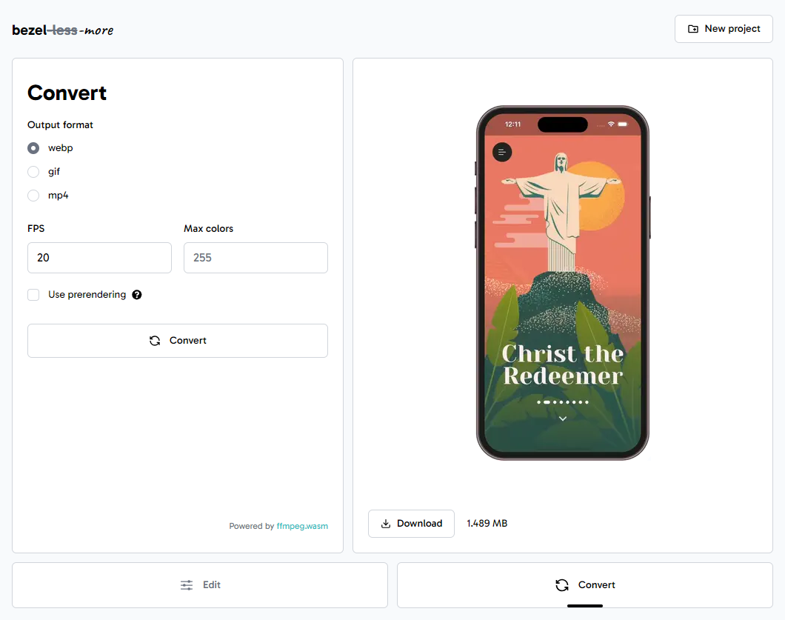

# bezel-more

**bezel-more** is a simple, privacy-friendly **video to GIF/WebP converter** that allows you to add a **device bezel** around your screen recordings. All processing is performed locally in your browser—no uploads or server-side video handling.

    <a href="https://radekvym.github.io/bezel-more/">
        <picture>
            <source srcset="./images/bezel-more-dark.png" media="(prefers-color-scheme: dark)">
            
        </picture>
    </a>

    <a href="https://radekvym.github.io/bezel-more/">
        <picture>
            <source srcset="./images/bezel-more-convert-dark.png" media="(prefers-color-scheme: dark)">
            
        </picture>
    </a>

**Try the app:** [radekvym.github.io/bezel-more](https://radekvym.github.io/bezel-more/)

## Features

- **Convert videos to GIF or WebP** formats directly in your browser
- **Add device bezels** (iPhones and selected Android phones) for polished, professional screen recordings
- **Privacy-first:** all processing happens client-side—your videos never leave your computer
- **No installation required:** runs completely in the browser
- **Powered by [ffmpeg.wasm](https://github.com/ffmpegwasm/ffmpeg.wasm)**—WebAssembly port of ffmpeg
- UI is built using [React](https://react.dev/) in combination with [Tailwind CSS](https://tailwindcss.com/)
