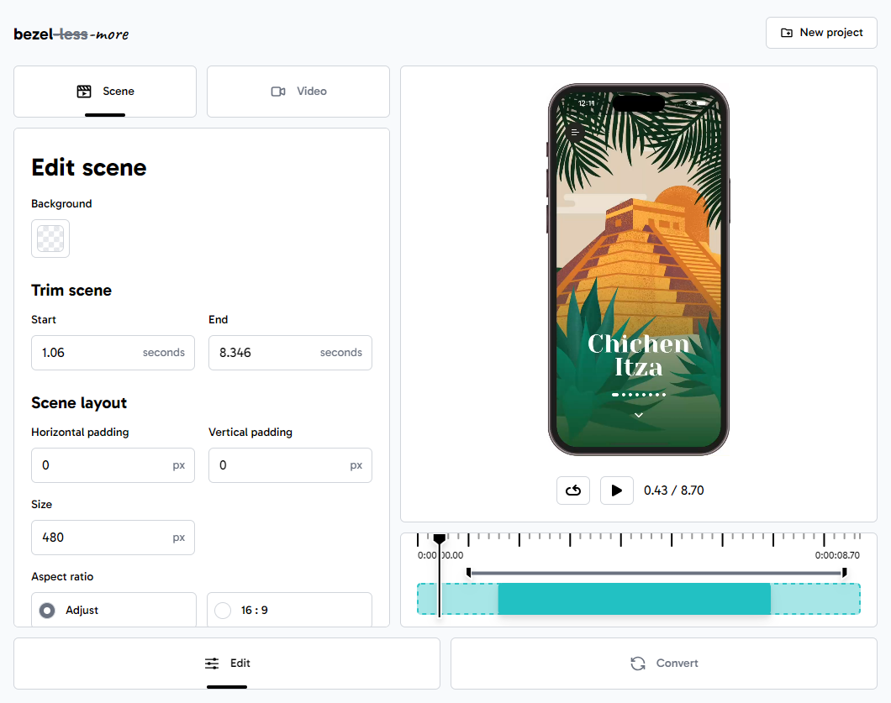

# bezel-more

Simple **video to GIF/WebP** converter that allows you to add a **device bezel** to your screen recordings.

    <a href="https://radekvym.github.io/bezel-more/">
        <picture>
            <source srcset="./images/bezel-more-dark.png" media="(prefers-color-scheme: dark)">
            
        </picture>
    </a>

    <a href="https://radekvym.github.io/bezel-more/">
        <picture>
            <source srcset="./images/bezel-more-convert-dark.png" media="(prefers-color-scheme: dark)">
            
        </picture>
    </a>

The application can be found on [radekvym.github.io/bezel-more](https://radekvym.github.io/bezel-more/).

## Features

Video processing is provided using the [ffmpeg library](https://ffmpeg.org/) via [Web Assembly](https://github.com/ffmpegwasm/ffmpeg.wasm). All the video processing is done on the client side. UI is built using [React](https://react.dev/) in combination with [Tailwind CSS](https://tailwindcss.com/).
